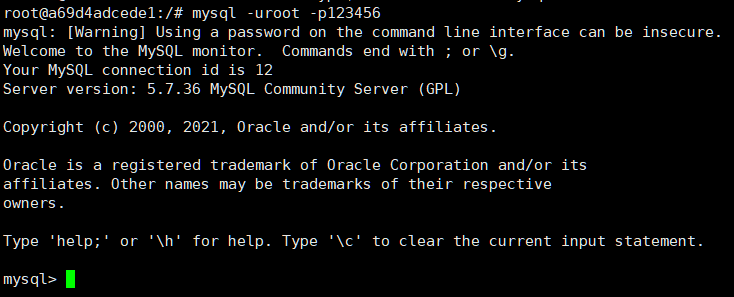
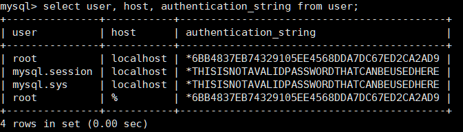
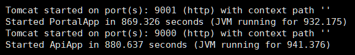
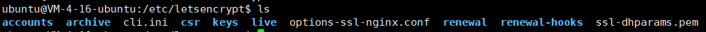
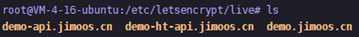
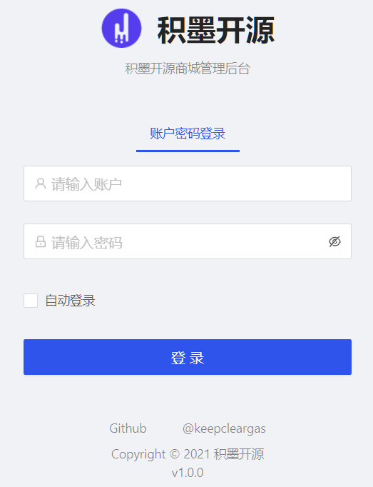
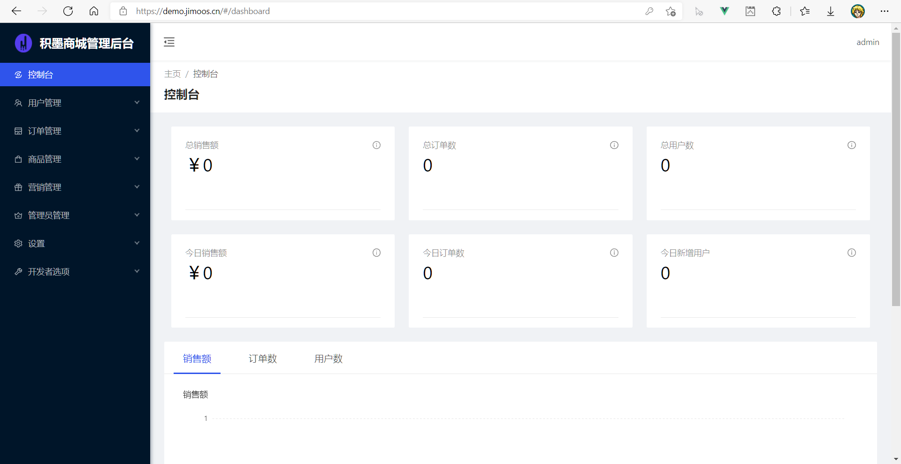
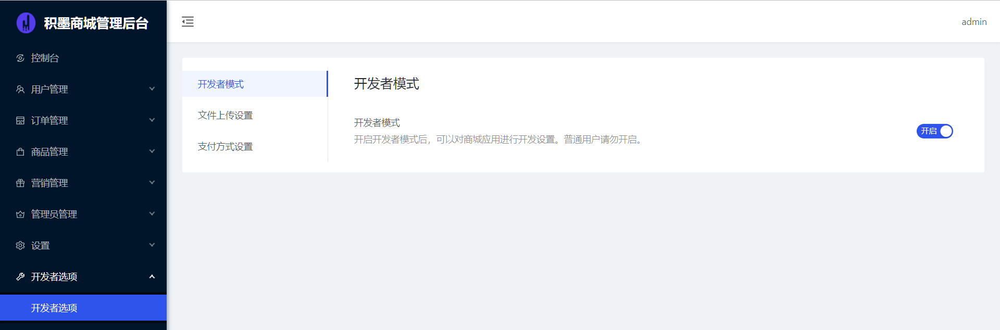
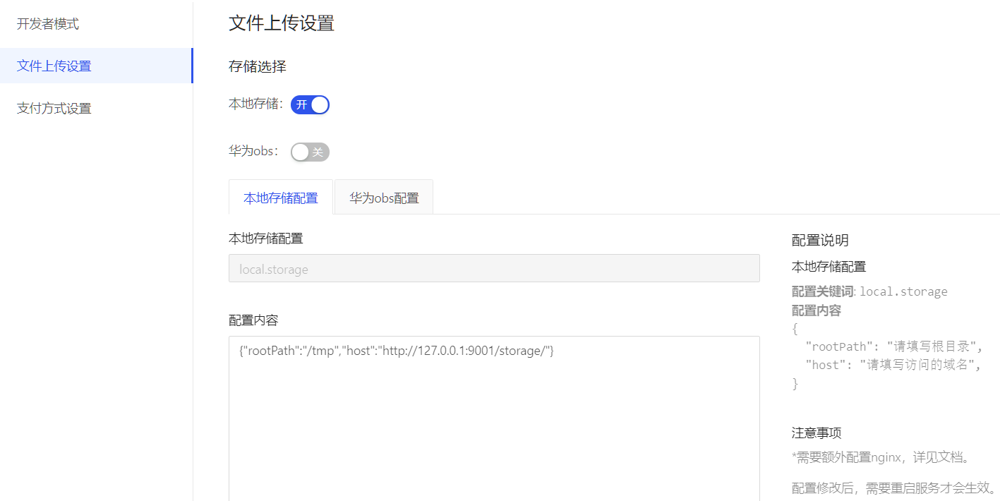

## 1. 准备
### 1.1 安装docker(以ubuntu为例)

```shell
curl -fsSL https://get.docker.com | bash -s docker --mirror Aliyun
```

### 1.2 docker安装MySQL
**也可以用远程mysql数据库**

docker安装mysql并创建jimoos_shop数据库

```shell
docker run -d --name mysql -e MYSQL_ROOT_PASSWORD=123456 -e MYSQL_DATABASE=jimoos_shop -e MYSQL_TCP_PORT=3306 -e character-set-server=utf8mb4 --expose=3306 mysql
```

进入mysql容器
```shell
docker exec -it mysql bash
mysql -uroot -p123456
```
成功登录mysql，如图所示



修改权限
```mysql
use mysql;
grant all privileges  on *.* to root@'%' identified by '123456';
select user, host, authentication_string from user;
```
显示如下


### 1.3 安装nginx

```shell
sudo apt-get update 
sudo apt-get install nginx
```

### 1.4 安装certbot(用于nginx证书申请)

```shell
sudo apt-get install certbot
sudo apt-get install python-certbot-nginx
```

## 2. 运行项目
查询mysql ip地址
```shell
docker inspect mysql
找到IPAddress, 如下
...
"Gateway": "192.168.100.1",
"GlobalIPv6Address": "",
"GlobalIPv6PrefixLen": 0,
"IPAddress": "192.168.100.4",
"IPPrefixLen": 24,
"IPv6Gateway": "",
"MacAddress": "02:42:c0:a8:64:04"
...
```
运行项目
```
docker run  -e SPRING_DATASOURCE_URL='jdbc:mysql://{url}/jimoos_shop?useUnicode=true&characterEncoding=utf8&useSSL=false' -e SPRING_DATASOURCE_USERNAME='{username}' -e SPRING_DATASOURCE_PASSWORD='{password}' -p 9000:9000 -p 9001:9001  ccr.ccs.tencentyun.com/jimoos/jimoos-shop:v1.0.0.b1
```
其中{url}为数据库地址，例如192.168.100.4:3306，{username}为数据库账号，{password}为数据库密码，也可以连接远程mysql数据库。
等待docker运行完成，输出如下日志则运行成功




## 3. 配置nginx
### 3.1 证书申请
申请证书
```
sudo certbot --nginx certonly --agree-tos --keep --no-eff-email --email email@example.com -d example.com 
```
修改email@example.com和exampl.com为你的邮箱和域名
成功后在目录 /etc/letsencrypt和/etc/letsencrypt/live 目录下会生成相关证书文件，如图





### 3.2 定时刷新脚本
证书有时间期限，需要定时刷新
编辑系统定时器脚本

``` 
sudo crontab -e
```
添加以下脚本(每月3日执行脚本)
``` 
* 3 1 * * certbot renew --renew-hook 'service nginx reload'
```

### 3.3 配置nginx
根据不同域名进行配置，例如
```
后台对应 127.0.0.1:9001
客户端对应 127.0.0.1:9000
```
进入/etc/nginx/conf.d，添加nginx配置，注意修改ssl配置
例如有demo.jimoos.cn域名需要访问后台管理页面，则需要添加如下配置，
如果有多个域名，需要配置多个

```
vim ht.conf

添加以下内容并保存
server {
  server_name     demo.jimoos.cn;

#  proxy_cache one;
    # listen [::]:443 ssl ipv6only=on; # managed by Certbot
    listen 443 ssl; # managed by Certbot
    ssl_certificate /etc/letsencrypt/live/demo.jimoos.cn/fullchain.pem; # managed by Certbot
    ssl_certificate_key /etc/letsencrypt/live/demo.jimoos.cn/privkey.pem; # managed by Certbot
    include /etc/letsencrypt/options-ssl-nginx.conf; # managed by Certbot
    ssl_dhparam /etc/letsencrypt/ssl-dhparams.pem; # managed by Certbot


    location / {
        proxy_set_header X-Forwarded-Host $host;
        proxy_set_header X-Forwarded-Server $host;
        proxy_set_header X-Forwarded-For $proxy_add_x_forwarded_for;
        proxy_pass http://127.0.0.1:9001;
    }
}
server {
    if ($host = demo.jimoos.cn) {
        return 301 https://$host$request_uri;
    } 

    listen 80 ;
    listen [::]:80 ;
    server_name demo.jimoos.cn;
    return 404;
}
```

## 4. 修改相关后台配置
配置完后浏览器输入后台域名(如 demo.jimoos.cn)，出现登录界面则项目启动成功，如图



登录默认管理员账号
```
账号：admin
密码：jimoos.cn
```

登录成功进入首页，如图



进入开发者选项并打开开发者模式，如图



### 4.1 文件上传设置
项目默认开启本地存储，如图


修改默认文件上传配置，本地存储的位置和访问路径并保存，例如
```json
{
  "rootPath": "/data/",
  "host": "https://demo-ht-api.jimoos.cn/storage/"
}
```

如果要启用华为obs，请参考配置内容输入相关配置并保存，参考如下
```json5
//华为OBS配置
//配置关键词: huawei.obs
//配置内容
{
  "accessKey": "请填写accessKey",
  "secretKey": "请填写secretKey",
  "endPoint": "请填写 endPoint 地址",
  "duration": 3600,
  "buckets": [
    {
      "type": 0,
      "bucketName": "bucketName1"
    },
    {
      "type": 1,
      "bucketName": "bucketName2"
    }
  ]
}
```

### 4.2 支付方式设置
项目默认开启线下支付，配置本地存储后无需额外配置，如图


如果要启用微信支付，请参考配置内容输入相关配置并保存，参考如下
```json5
//配置说明
//微信支付配置
//配置关键词: wx.pay
//配置内容
{
    "appId": "请填写appId",
    "mchId": "请填写mchId",
    "mchKey": "请填写mchKey",
    "notifyUrl": "请填写notifyUrl",
    "keyPath": "",
    "refundNotifyUrl": ""
}
```

**修改后需要重启服务才会生效。**

## 5. 体验

demo体验：demo.jimoos.cn

小程序二维码：

