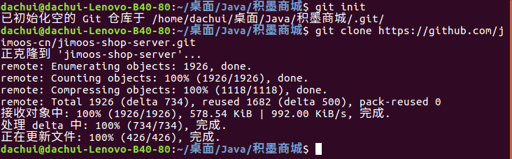
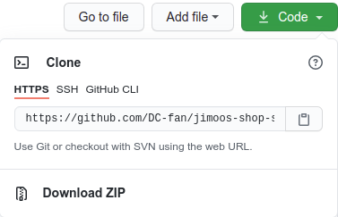
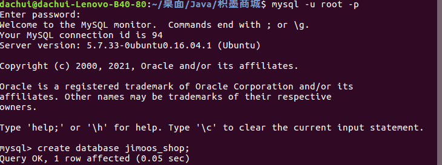
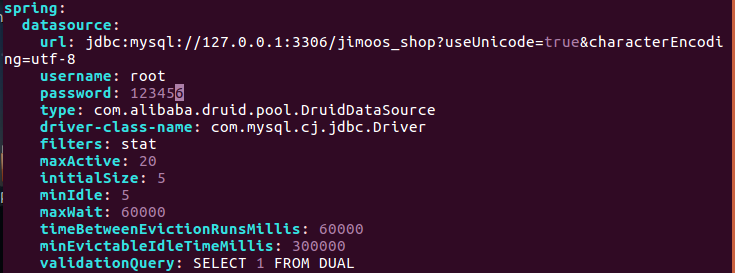
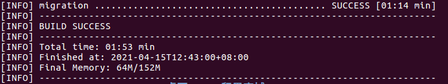
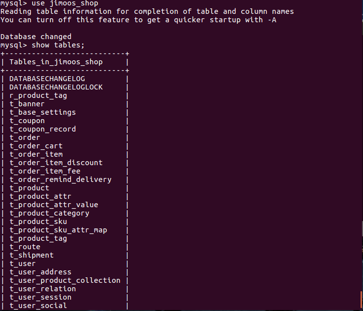
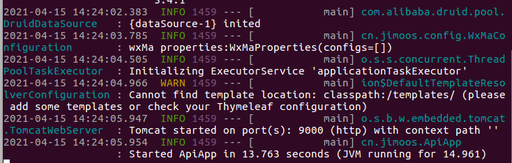

## 快速开始

### 下载代码

#### git 命令

1. 新建存放代码的文件夹
2. 初始化空的git仓库：`git init`
3. clone代码：`git clone https://github.com/jimoos-cn/jimoos-shop-server.git`



#### 下载压缩包




点击下载zip，解压到本地

### 数据库导入

1.  新建数据库

   ```sql
   mysql -u root -p 
   create database jimoos_shop;
   ```

   

2. 修改数据库配置文件

   ```shell
   vim migration/src/main/resources/application.yml  
   // 当前在jimoos-shop-server目录下，在构建项目之前需要修改jimoos-shop-server/starter/api-starter/src/main/resources/application.yml以及jimoos-shop-server/starter/portal-starter/src/main/resources/application.yml中数据库相应的设置
   // 将spring.datasource.username和spring,dataroutce.password修改为自己的username,password
   ```

   

   

3. 执行数据迁移命令行(在jimoos-shop-server目录下)

   ```shell
   mvn -Dtest=MigrationDone test -DfailIfNoTests=false 
   迁移成功如下图，此时可以从刚才创建的数据库中找到对应的迁移成功的表和数据
   ```

   

   


### 构建及启动项目

```shell
// 构建项目
mvn clean package -Dmaven.test.skip=true -s docker/settings.xml 
// 启动客户端接口模块
cd starter/api-starter/target 
java -jar jm-api-starter-0.0.1.jar 
```

启动成功

