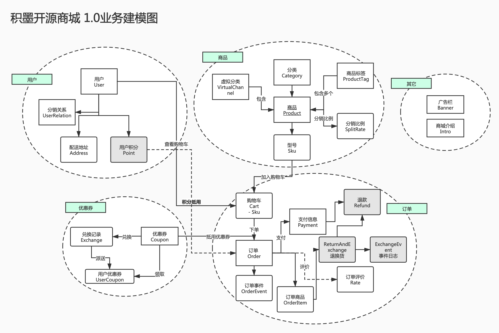

# 积墨开源商城 服务端代码


## 快速开始

### 下载代码

#### git 命令

1. 新建存放代码的文件夹
2. 初始化空的git仓库：`git init`
3. clone代码：`git clone https://github.com/jimoos-cn/jimoos-shop-server.git`


#### 下载压缩包


点击下载zip，解压到本地

### 数据库导入

1.  新建数据库

   ```sql
   mysql -u root -p 
   create database jimoos_shop;
   ```

   

2. 修改数据库配置文件

   ```shell
   vim migration/src/main/resources/application.yml  
   // 当前在jimoos-shop-server目录下，在构建项目之前需要修改jimoos-shop-server/starter/api-starter/src/main/resources/application.yml以及jimoos-shop-server/starter/portal-starter/src/main/resources/application.yml中数据库相应的设置
   // 将spring.datasource.username和spring,dataroutce.password修改为自己的username,password
   ```

   

   

3. 执行数据迁移命令行(在jimoos-shop-server目录下)

   ```shell
   mvn -Dtest=MigrationDone test -DfailIfNoTests=false 
   迁移成功如下图，此时可以从刚才创建的数据库中找到对应的迁移成功的表和数据
   ```

   

   


### 构建及启动项目

```shell
// 构建项目
mvn clean package -Dmaven.test.skip=true -s docker/settings.xml 
// 启动客户端接口模块
cd starter/api-starter/target 
java -jar jm-api-starter-0.0.1.jar 
```

启动成功


### 

## 业务建模图



## 数据库导入

执行数据迁移命令行

`mvn -Dtest=MigrationDone test -DfailIfNoTests=false`

## 开发文档入口

文档地址: https://jimoos-cn.github.io/jimoos-shop-server/

## TODO

[X] 数据库配置读取     
[X] 华为云OBS接入    
[X] 用户注册    
[X] Banner管理    
[X] 商品管理    
[X] 购物车     
[ ] 下单      
[X] 优惠券     
[ ] 我的订单    
[ ] 商品集合  
[-] 商城介绍


----
[] 接口文档  
[-] 接口部署

## 项目结构

- api-starter 客户端接口入口
- portal-starter 后台管理接口入口
- migration 数据库迁移管理
- `addons/@`下 为项目内插件
- `addons/depends`为外部插件，外部插件禁止修改。
